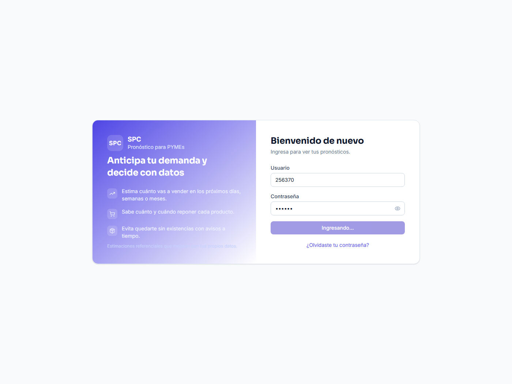
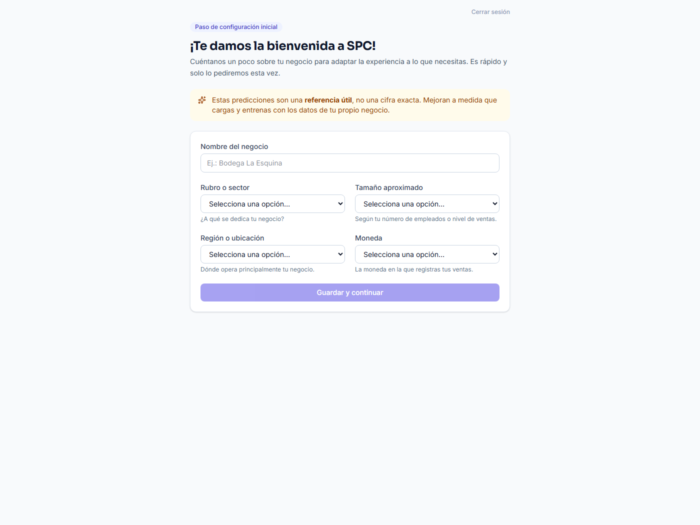
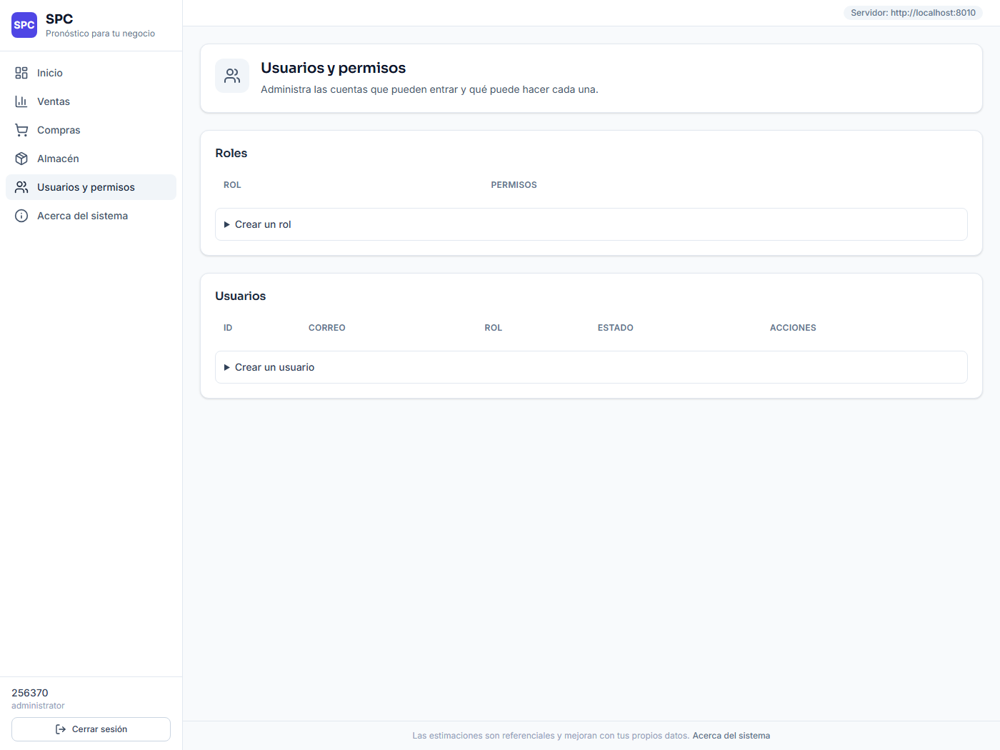
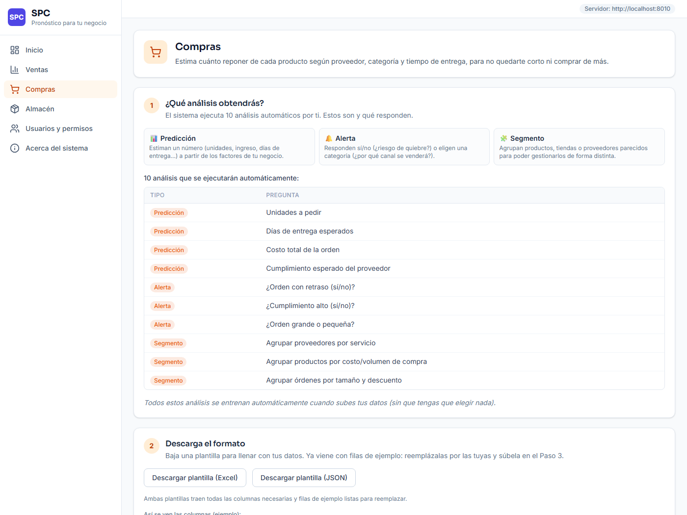
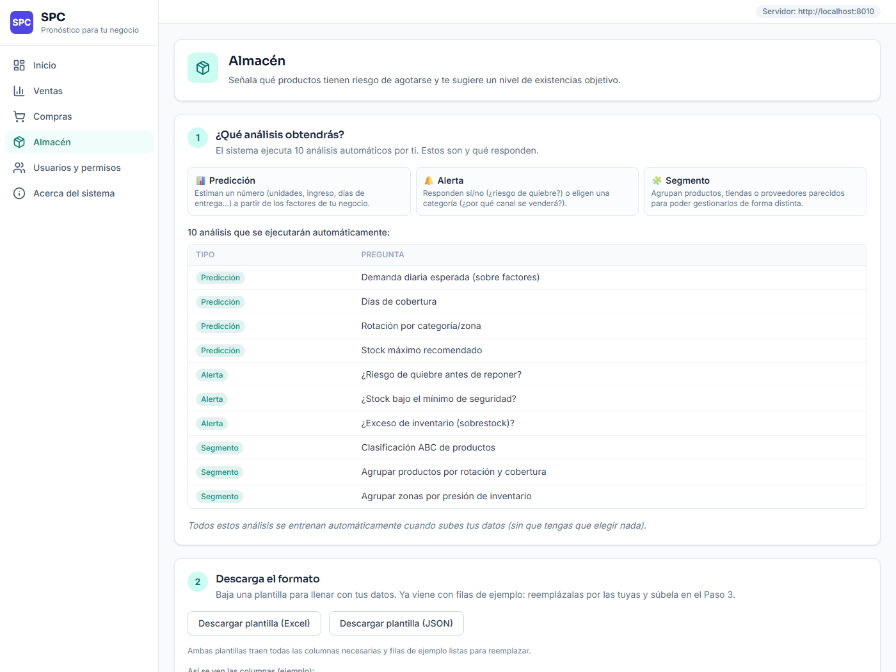
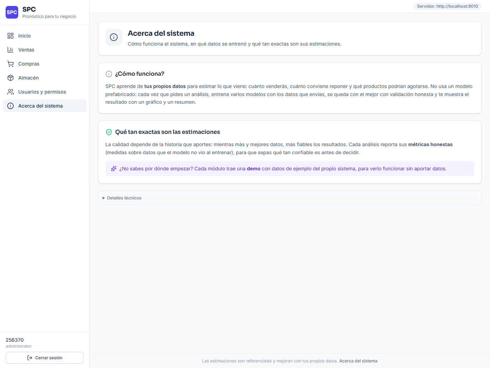
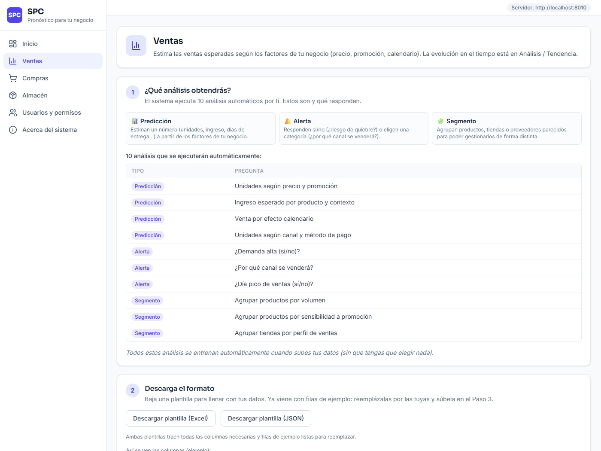

# Documento de Pruebas de Caja Negra

**SPC — Sistema de Predicción y Comercialización**

- **Tipo de Prueba:** Caja Negra
- **Técnicas:** Partición de Equivalencias, Análisis de Valores Borde, Tabla de Decisión, Caso de Uso
- **Total de Escenarios:** 16
- **Universidad Privada Antenor Orrego** — Proyecto de Taller Integrador I

## Índice de Escenarios de Prueba

| N° | ID HU | Escenario | Módulo | Técnica |
|----|-------|-----------|--------|---------|
| 1 | HU-1.1 | Inicio y Cierre de Sesión | Autenticación | Partición de equivalencias y análisis de valores borde |
| 2 | HU-1.2 | Restablecer Contraseña por Correo | Autenticación | Tabla de decisión |
| 3 | HU-1.3 | Onboarding / Perfil de Negocio | Perfil | Partición de equivalencias |
| 4 | HU-1.4 | Creación de Roles con Permisos | Rol | Partición de equivalencias |
| 5 | HU-1.5 | Editar Rol (Administrador Protegido) | Rol | Tabla de decisión |
| 6 | HU-1.6 | Eliminar Rol con Usuarios Asignados | Rol | Tabla de decisión |
| 7 | HU-1.7 | Creación de Cuenta de Usuario | Usuario | Partición de equivalencias |
| 8 | HU-1.8 | Editar Usuario (Rol, Estado y Contraseña) | Usuario | Tabla de decisión |
| 9 | HU-1.9 | Visibilidad de Secciones según Permiso | Permisos | Tabla de decisión |
| 10 | HU-2.1 | Análisis 3×3 de VENTAS (Regresión + Clasificación + Clustering) | Ventas | Caso de uso |
| 11 | HU-2.2 | Análisis 3×3 de COMPRAS | Compras | Caso de uso |
| 12 | HU-2.3 | Análisis 3×3 de ALMACÉN | Almacén | Caso de uso |
| 13 | HU-2.4 | Ejecutar Consulta del Catálogo (JSON) | Catálogo | Partición de equivalencias |
| 14 | HU-2.5 | Carga de Archivo Excel/JSON y Validación | Carga | Partición de equivalencias y análisis de valores borde |
| 15 | HU-2.6 | Historial y Detalle de Análisis | Historial | Caso de uso |
| 16 | HU-2.7 | Servir Modelo Guardado y Exportar Reportes | Reportes | Caso de uso |

## Escenario 1.0 — Inicio y Cierre de Sesión

- **Historia de Usuario:** HU-1.1: Autenticación
- **Módulo / Contexto:** Autenticación
- **Tipo de Prueba:** Prueba de Caja Negra
- **Técnica Aplicada:** Partición de equivalencias y análisis de valores borde

#
**Evidencias de la prueba:**

## Datos de entrada

- **Descripción:** Verificar que el sistema permita iniciar y cerrar sesión con credenciales válidas e inválidas, emita un token de sesión firmado y proteja el acceso a las secciones internas.
- **Entorno:** Pantalla de inicio de sesión de SPC con los campos usuario (id) y contraseña, y el botón Iniciar Sesión. El cierre de sesión se realiza desde el menú de la cabecera.
- **Parámetros involucrados:**
  - Campo: Usuario (id)
  - Campo: Contraseña
  - Botón: Iniciar Sesión
  - Botón: Cerrar Sesión
- **Respuesta de otros módulos:** Se invoca POST /auth/login, que valida las credenciales contra el hash almacenado y emite un token; GET /auth/me devuelve la identidad y permisos.

### Condiciones iniciales (casos de prueba)

| # | Condición | Resultado esperado |
|---|-----------|--------------------|
| 1 | Se ingresa usuario y contraseña correctos de una cuenta activa. | El sistema redirige al panel principal (o al onboarding si es el primer ingreso). La sesión queda activa. |
| 2 | Se ingresa usuario correcto y contraseña incorrecta. | El sistema muestra un mensaje genérico «Id o contraseña incorrectos» y no permite el acceso. |
| 3 | Se ingresan las credenciales de una cuenta desactivada (is_active = false). | El sistema rechaza el acceso con el mismo mensaje genérico, sin revelar que la cuenta existe. |
| 4 | Se dejan vacíos los campos de usuario y contraseña y se presiona Iniciar Sesión. | El sistema muestra validaciones indicando que los campos son obligatorios; no llama a la API. |
| 5 | Se intenta acceder a una sección interna con el token expirado o ausente. | El sistema responde 401 y redirige al login sin exponer la funcionalidad protegida. |
| 6 | El usuario con sesión activa presiona Cerrar Sesión. | El sistema invalida el token, limpia la sesión y regresa al login. |

_Estado final de variables: se adjuntan capturas de pantalla como evidencia._

### Requisitos de configuración

- **Método de Prueba:** Partición de equivalencias: credenciales válidas vs inválidas. Análisis de valores borde: campos vacíos, cuenta inactiva y token expirado.
- **Módulos del sistema:** auth.py (login, me), service/seguridad.py (crear_token / verificar_token), LoginPage.tsx, AuthContext.tsx.
- **Hardware y Software:** PC con navegador Google Chrome (última versión). Backend FastAPI (Uvicorn) ejecutado localmente o en Render. Frontend React 19 + Vite. Base de datos PostgreSQL (Supabase / Neon).
- **Procedimiento de ejecución:**
  1. Navegar a la URL del sistema SPC.
  2. Ejecutar cada condición ingresando los datos descritos.
  3. Presionar Iniciar Sesión y observar la respuesta.
  4. Para la condición 6: estando autenticado, presionar Cerrar Sesión.
  5. Registrar el resultado y capturar la pantalla.
- **Dependencias:**
  - Debe existir al menos una cuenta registrada.
  - El backend debe estar en ejecución.
- **Estado de la prueba:** Pasó
- **Responsable:** Equipo SPC

## Escenario 2.0 — Restablecer Contraseña por Correo

- **Historia de Usuario:** HU-1.2: Restablecer contraseña
- **Módulo / Contexto:** Autenticación
- **Tipo de Prueba:** Prueba de Caja Negra
- **Técnica Aplicada:** Tabla de decisión

### Datos de entrada

- **Descripción:** Verificar el flujo de recuperación de contraseña por correo: solicitud del enlace, validez del token de un solo uso y fijación de la nueva contraseña.
- **Entorno:** Enlace «¿Olvidó su contraseña?» en el login y página de restablecimiento accesible por la URL /reset?token=… sin sesión previa.
- **Parámetros involucrados:**
  - Campo: Correo electrónico
  - Enlace de restablecimiento (token)
  - Campo: Nueva contraseña
- **Respuesta de otros módulos:** POST /auth/forgot genera un token ligado al hash actual y lo envía por correo; POST /auth/reset valida el token y actualiza la contraseña.

### Condiciones iniciales (casos de prueba)

| # | Condición | Resultado esperado |
|---|-----------|--------------------|
| 1 | Se solicita el enlace con un correo asociado a una cuenta activa. | El sistema envía el correo con el enlace y muestra una respuesta genérica de confirmación. |
| 2 | Se solicita el enlace con un correo que no existe o de una cuenta inactiva. | El sistema muestra la misma respuesta genérica (no revela si el correo existe) y no envía correo. |
| 3 | Se abre el enlace y se fija una contraseña nueva válida. | El sistema fija la nueva contraseña e invalida el token; permite iniciar sesión con ella. |
| 4 | Se reutiliza el mismo enlace una segunda vez tras cambiar la contraseña. | El sistema responde 400 «El enlace no es válido o ya expiró»; la contraseña no cambia. |
| 5 | Se abre un enlace expirado (fuera del TTL de restablecimiento). | El sistema responde 400 e invita a solicitar un enlace nuevo. |

_Estado final de variables: se adjuntan capturas de pantalla como evidencia._

### Requisitos de configuración

- **Método de Prueba:** Tabla de decisión sobre las combinaciones (correo válido/ inválido) × (token vigente / usado / expirado) y el resultado esperado en cada rama.
- **Módulos del sistema:** auth.py (forgot_password, reset_password), seguridad.py (crear_token_reset / verificar_token_reset), ResetPasswordPage.tsx.
- **Hardware y Software:** PC con navegador Google Chrome (última versión). Backend FastAPI (Uvicorn) ejecutado localmente o en Render. Frontend React 19 + Vite. Base de datos PostgreSQL (Supabase / Neon).
- **Procedimiento de ejecución:**
  1. Desde el login, abrir «¿Olvidó su contraseña?» e ingresar el correo.
  2. Revisar el correo (o el log del backend si no hay SMTP) y abrir el enlace.
  3. Fijar la nueva contraseña y confirmar.
  4. Reintentar con el mismo enlace y con uno expirado.
  5. Registrar cada resultado y capturar la pantalla.
- **Dependencias:**
  - Debe existir una cuenta con correo registrado.
  - SMTP configurado (o revisar el log del backend).
- **Estado de la prueba:** Pasó
- **Responsable:** Equipo SPC

## Escenario 3.0 — Onboarding / Perfil de Negocio

- **Historia de Usuario:** HU-1.3: Onboarding del negocio
- **Módulo / Contexto:** Perfil
- **Tipo de Prueba:** Prueba de Caja Negra
- **Técnica Aplicada:** Partición de equivalencias

#
**Evidencias de la prueba:**

## Datos de entrada

- **Descripción:** Verificar que un usuario no administrador complete obligatoriamente el perfil de negocio en su primer ingreso y que el sistema valide cada opción.
- **Entorno:** Formulario de onboarding con nombre del negocio, sector, tamaño, región y moneda; se muestra tras el primer login de una cuenta no administradora.
- **Parámetros involucrados:**
  - Campo: Nombre del negocio
  - Selección: Sector
  - Selección: Tamaño
  - Selección: Región
  - Selección: Moneda
- **Respuesta de otros módulos:** GET /profile/options puebla los selectores; PUT /profile valida cada valor contra el conjunto permitido, persiste el perfil y marca onboarding_done.

### Condiciones iniciales (casos de prueba)

| # | Condición | Resultado esperado |
|---|-----------|--------------------|
| 1 | Se completan todos los campos con opciones válidas. | El sistema guarda el perfil, marca el onboarding como hecho y redirige al panel principal. |
| 2 | Se envía el formulario con el nombre del negocio vacío. | El sistema muestra la validación de campo obligatorio y no envía la solicitud. |
| 3 | Se fuerza (vía API) un sector fuera del conjunto permitido. | El sistema responde 400 «Sector inválido» y no persiste el perfil. |
| 4 | Un usuario ya con onboarding hecho intenta volver a la pantalla de onboarding. | El sistema redirige al panel principal; no vuelve a exigir el onboarding. |

_Estado final de variables: se adjuntan capturas de pantalla como evidencia._

### Requisitos de configuración

- **Método de Prueba:** Partición de equivalencias: valores dentro del conjunto permitido vs fuera de él, para cada selector, y campo obligatorio vacío vs con contenido.
- **Módulos del sistema:** auth.py (opciones_perfil, guardar_perfil), OnboardingPage.tsx.
- **Hardware y Software:** PC con navegador Google Chrome (última versión). Backend FastAPI (Uvicorn) ejecutado localmente o en Render. Frontend React 19 + Vite. Base de datos PostgreSQL (Supabase / Neon).
- **Procedimiento de ejecución:**
  1. Ingresar por primera vez con una cuenta no administradora.
  2. Completar el formulario según cada condición.
  3. Enviar y observar la validación o la redirección.
  4. Registrar el resultado y capturar la pantalla.
- **Dependencias:**
  - Cuenta no administradora sin onboarding previo.
  - Backend en ejecución.
- **Estado de la prueba:** Pasó
- **Responsable:** Equipo SPC

## Escenario 4.0 — Creación de Roles con Permisos

- **Historia de Usuario:** HU-1.4: Gestión de roles
- **Módulo / Contexto:** Rol
- **Tipo de Prueba:** Prueba de Caja Negra
- **Técnica Aplicada:** Partición de equivalencias

#
**Evidencias de la prueba:**

## Datos de entrada

- **Descripción:** Verificar que un administrador pueda crear roles con un conjunto de permisos válidos y que el sistema rechace nombres duplicados o permisos desconocidos.
- **Entorno:** Editor de roles dentro de la sección de administración; requiere permiso de administración.
- **Parámetros involucrados:**
  - Campo: Nombre del rol
  - Campo: Descripción
  - Selección múltiple: Permisos
- **Respuesta de otros módulos:** GET /permissions provee el catálogo; POST /roles valida los permisos y crea el rol.

### Condiciones iniciales (casos de prueba)

| # | Condición | Resultado esperado |
|---|-----------|--------------------|
| 1 | Se crea un rol con nombre único y permisos válidos del catálogo. | El sistema crea el rol (201) y lo muestra en el listado. |
| 2 | Se crea un rol con un nombre que ya existe. | El sistema responde 409 «Ya existe un rol con ese nombre». |
| 3 | Se envía un permiso que no está en el catálogo. | El sistema responde 400 «Permisos desconocidos» y no crea el rol. |
| 4 | Un usuario sin permiso de administración intenta crear un rol. | El sistema responde 403 y no expone la operación. |

_Estado final de variables: se adjuntan capturas de pantalla como evidencia._

### Requisitos de configuración

- **Método de Prueba:** Partición de equivalencias: nombre único vs duplicado; permisos válidos vs desconocidos; con vs sin permiso de administración.
- **Módulos del sistema:** auth.py (crear_rol, listar_permisos), UsersPage.tsx (editor de roles).
- **Hardware y Software:** PC con navegador Google Chrome (última versión). Backend FastAPI (Uvicorn) ejecutado localmente o en Render. Frontend React 19 + Vite. Base de datos PostgreSQL (Supabase / Neon).
- **Procedimiento de ejecución:**
  1. Ingresar como administrador y abrir el editor de roles.
  2. Crear un rol por cada condición.
  3. Observar la respuesta del sistema y el listado.
  4. Registrar el resultado y capturar la pantalla.
- **Dependencias:**
  - Cuenta con permiso de administración.
  - Catálogo de permisos disponible.
- **Estado de la prueba:** Pasó
- **Responsable:** Equipo SPC

## Escenario 5.0 — Editar Rol (Administrador Protegido)

- **Historia de Usuario:** HU-1.5: Editar rol
- **Módulo / Contexto:** Rol
- **Tipo de Prueba:** Prueba de Caja Negra
- **Técnica Aplicada:** Tabla de decisión

#
**Evidencias de la prueba:**

## Datos de entrada

- **Descripción:** Verificar que se pueda editar la descripción y los permisos de un rol, salvo los permisos del rol administrador, que están protegidos.
- **Entorno:** Editor de roles; el rol administrador aparece marcado como protegido.
- **Parámetros involucrados:**
  - Selección: Rol a editar
  - Campo: Descripción
  - Selección múltiple: Permisos
- **Respuesta de otros módulos:** PATCH /roles/{id} aplica los cambios salvo cuando el rol es el administrador y se intentan cambiar sus permisos.

### Condiciones iniciales (casos de prueba)

| # | Condición | Resultado esperado |
|---|-----------|--------------------|
| 1 | Se edita la descripción de un rol normal. | El sistema actualiza la descripción y refleja el cambio. |
| 2 | Se cambian los permisos de un rol normal por un conjunto válido. | El sistema actualiza los permisos del rol. |
| 3 | Se intentan modificar los permisos del rol administrador. | El sistema responde 400 «No se pueden modificar los permisos del rol administrador». |
| 4 | Se edita un rol con un id inexistente. | El sistema responde 404 «El rol no existe». |

_Estado final de variables: se adjuntan capturas de pantalla como evidencia._

### Requisitos de configuración

- **Método de Prueba:** Tabla de decisión: (rol normal / rol admin) × (edita descripción / edita permisos) → acción permitida o bloqueada.
- **Módulos del sistema:** auth.py (actualizar_rol), UsersPage.tsx.
- **Hardware y Software:** PC con navegador Google Chrome (última versión). Backend FastAPI (Uvicorn) ejecutado localmente o en Render. Frontend React 19 + Vite. Base de datos PostgreSQL (Supabase / Neon).
- **Procedimiento de ejecución:**
  1. Ingresar como administrador y abrir el editor de roles.
  2. Aplicar cada edición según la condición.
  3. Observar la respuesta del sistema.
  4. Registrar el resultado y capturar la pantalla.
- **Dependencias:**
  - Deben existir un rol normal y el rol administrador.
  - Cuenta con permiso de administración.
- **Estado de la prueba:** Pasó
- **Responsable:** Equipo SPC

## Escenario 6.0 — Eliminar Rol con Usuarios Asignados

- **Historia de Usuario:** HU-1.6: Eliminar rol
- **Módulo / Contexto:** Rol
- **Tipo de Prueba:** Prueba de Caja Negra
- **Técnica Aplicada:** Tabla de decisión

#
**Evidencias de la prueba:**

## Datos de entrada

- **Descripción:** Verificar que solo se puedan eliminar roles sin usuarios asignados y que el rol administrador esté protegido.
- **Entorno:** Listado de roles con la acción Eliminar por fila.
- **Parámetros involucrados:**
  - Selección: Rol a eliminar
  - Botón: Eliminar
- **Respuesta de otros módulos:** DELETE /roles/{id} verifica que el rol no sea el administrador y que no tenga usuarios asignados.

### Condiciones iniciales (casos de prueba)

| # | Condición | Resultado esperado |
|---|-----------|--------------------|
| 1 | Se elimina un rol normal sin usuarios asignados. | El sistema elimina el rol (204) y lo quita del listado. |
| 2 | Se intenta eliminar un rol que tiene usuarios asignados. | El sistema responde 400 «No se puede eliminar un rol con usuarios asignados». |
| 3 | Se intenta eliminar el rol administrador. | El sistema responde 400 «No se puede eliminar el rol administrador». |
| 4 | Se elimina un rol con un id inexistente. | El sistema responde 404 «El rol no existe». |

_Estado final de variables: se adjuntan capturas de pantalla como evidencia._

### Requisitos de configuración

- **Método de Prueba:** Tabla de decisión: (rol admin / con usuarios / vacío / inexistente) → resultado esperado.
- **Módulos del sistema:** auth.py (eliminar_rol), UsersPage.tsx.
- **Hardware y Software:** PC con navegador Google Chrome (última versión). Backend FastAPI (Uvicorn) ejecutado localmente o en Render. Frontend React 19 + Vite. Base de datos PostgreSQL (Supabase / Neon).
- **Procedimiento de ejecución:**
  1. Ingresar como administrador y abrir el listado de roles.
  2. Ejecutar Eliminar por cada condición.
  3. Observar la respuesta del sistema.
  4. Registrar el resultado y capturar la pantalla.
- **Dependencias:**
  - Un rol con usuarios asignados y otro vacío.
  - Cuenta con permiso de administración.
- **Estado de la prueba:** Pasó
- **Responsable:** Equipo SPC

## Escenario 7.0 — Creación de Cuenta de Usuario

- **Historia de Usuario:** HU-1.7: Crear usuario
- **Módulo / Contexto:** Usuario
- **Tipo de Prueba:** Prueba de Caja Negra
- **Técnica Aplicada:** Partición de equivalencias

#
**Evidencias de la prueba:**

## Datos de entrada

- **Descripción:** Verificar que un administrador cree cuentas asignando un rol existente y que el sistema rechace ids duplicados o roles inexistentes.
- **Entorno:** Formulario de alta de usuario en la sección de administración.
- **Parámetros involucrados:**
  - Campo: Id de usuario
  - Campo: Contraseña
  - Selección: Rol
  - Campo: Correo (opcional)
- **Respuesta de otros módulos:** POST /users valida que el rol exista y que el id no esté en uso antes de crear la cuenta.

### Condiciones iniciales (casos de prueba)

| # | Condición | Resultado esperado |
|---|-----------|--------------------|
| 1 | Se crea una cuenta con id único, contraseña válida y un rol existente. | El sistema crea la cuenta (201) y la muestra en el listado. |
| 2 | Se crea una cuenta con un id que ya existe. | El sistema responde 409 «Ya existe un usuario con ese id». |
| 3 | Se asigna un rol con id inexistente. | El sistema responde 404 «El rol no existe». |
| 4 | Se deja vacío el id o la contraseña. | El sistema muestra la validación de campo obligatorio y no envía la solicitud. |

_Estado final de variables: se adjuntan capturas de pantalla como evidencia._

### Requisitos de configuración

- **Método de Prueba:** Partición de equivalencias: id único vs duplicado; rol existente vs inexistente; campos completos vs vacíos.
- **Módulos del sistema:** auth.py (crear_usuario, listar_usuarios), UsersPage.tsx.
- **Hardware y Software:** PC con navegador Google Chrome (última versión). Backend FastAPI (Uvicorn) ejecutado localmente o en Render. Frontend React 19 + Vite. Base de datos PostgreSQL (Supabase / Neon).
- **Procedimiento de ejecución:**
  1. Ingresar como administrador y abrir el alta de usuarios.
  2. Crear una cuenta por cada condición.
  3. Observar la respuesta del sistema y el listado.
  4. Registrar el resultado y capturar la pantalla.
- **Dependencias:**
  - Al menos un rol existente.
  - Cuenta con permiso de administración.
- **Estado de la prueba:** Pasó
- **Responsable:** Equipo SPC

## Escenario 8.0 — Editar Usuario (Rol, Estado y Contraseña)

- **Historia de Usuario:** HU-1.8: Editar usuario
- **Módulo / Contexto:** Usuario
- **Tipo de Prueba:** Prueba de Caja Negra
- **Técnica Aplicada:** Tabla de decisión

#
**Evidencias de la prueba:**

## Datos de entrada

- **Descripción:** Verificar la edición de rol, estado (activo/inactivo) y contraseña de una cuenta, y el efecto de desactivar una cuenta sobre su acceso.
- **Entorno:** Ficha de edición de usuario en la sección de administración.
- **Parámetros involucrados:**
  - Selección: Rol
  - Interruptor: Activo / Inactivo
  - Campo: Nueva contraseña
  - Campo: Correo
- **Respuesta de otros módulos:** PATCH /users/{id} aplica los cambios; una cuenta inactiva queda rechazada en el login.

### Condiciones iniciales (casos de prueba)

| # | Condición | Resultado esperado |
|---|-----------|--------------------|
| 1 | Se cambia el rol de una cuenta a otro rol existente. | El sistema actualiza el rol y refleja los nuevos permisos. |
| 2 | Se desactiva una cuenta activa (is_active = false). | El sistema marca la cuenta como inactiva. |
| 3 | La cuenta desactivada intenta iniciar sesión. | El sistema rechaza el acceso con el mensaje genérico de credenciales inválidas. |
| 4 | Se edita un usuario con un id inexistente. | El sistema responde 404 «No existe el usuario». |

_Estado final de variables: se adjuntan capturas de pantalla como evidencia._

### Requisitos de configuración

- **Método de Prueba:** Tabla de decisión: (cambia rol / desactiva / login tras desactivar / id inexistente) → resultado esperado.
- **Módulos del sistema:** auth.py (actualizar_usuario, login), UsersPage.tsx.
- **Hardware y Software:** PC con navegador Google Chrome (última versión). Backend FastAPI (Uvicorn) ejecutado localmente o en Render. Frontend React 19 + Vite. Base de datos PostgreSQL (Supabase / Neon).
- **Procedimiento de ejecución:**
  1. Ingresar como administrador y abrir la edición de una cuenta.
  2. Aplicar cada cambio según la condición.
  3. Para la condición 3: cerrar sesión e intentar entrar con la cuenta desactivada.
  4. Registrar el resultado y capturar la pantalla.
- **Dependencias:**
  - Una cuenta editable distinta del administrador.
  - Cuenta con permiso de administración.
- **Estado de la prueba:** Pasó
- **Responsable:** Equipo SPC

## Escenario 9.0 — Visibilidad de Secciones según Permiso

- **Historia de Usuario:** HU-1.9: Control de acceso por rol
- **Módulo / Contexto:** Permisos
- **Tipo de Prueba:** Prueba de Caja Negra
- **Técnica Aplicada:** Tabla de decisión

#
**Evidencias de la prueba:**

## Datos de entrada

- **Descripción:** Verificar que el menú y las rutas muestren únicamente las secciones para las que el rol tiene permiso.
- **Entorno:** Panel principal de SPC; el menú lateral se arma a partir de los permisos del rol.
- **Parámetros involucrados:**
  - Rol del usuario autenticado
  - Secciones: Inicio, Ventas, Compras, Inventario, Usuarios, Acerca de
- **Respuesta de otros módulos:** GET /auth/me entrega los permisos; useSeccionesVisibles filtra las secciones renderizadas.

### Condiciones iniciales (casos de prueba)

| # | Condición | Resultado esperado |
|---|-----------|--------------------|
| 1 | Un rol con permiso solo de Ventas inicia sesión. | El menú muestra únicamente Ventas; las demás secciones no aparecen. |
| 2 | Ese rol intenta navegar por URL a la sección Usuarios (sin permiso). | El sistema redirige a la primera sección permitida; no muestra Usuarios. |
| 3 | Un rol sin ninguna sección permitida inicia sesión. | El sistema muestra el aviso «Su rol no tiene acceso a ninguna sección». |
| 4 | El administrador inicia sesión. | El menú muestra todas las secciones, incluida Usuarios. |

_Estado final de variables: se adjuntan capturas de pantalla como evidencia._

### Requisitos de configuración

- **Método de Prueba:** Tabla de decisión: permisos del rol × sección solicitada → visible / redirigido / bloqueado.
- **Módulos del sistema:** auth.py (me, listar_permisos), useSeccionesVisibles.ts, App.tsx, Layout.tsx.
- **Hardware y Software:** PC con navegador Google Chrome (última versión). Backend FastAPI (Uvicorn) ejecutado localmente o en Render. Frontend React 19 + Vite. Base de datos PostgreSQL (Supabase / Neon).
- **Procedimiento de ejecución:**
  1. Preparar roles con distintos permisos.
  2. Iniciar sesión con cada rol y revisar el menú.
  3. Intentar la navegación directa por URL a una sección no permitida.
  4. Registrar el resultado y capturar la pantalla.
- **Dependencias:**
  - Roles con permisos distintos y el rol administrador.
  - Backend en ejecución.
- **Estado de la prueba:** Pasó
- **Responsable:** Equipo SPC

## Escenario 10.0 — Análisis 3×3 de VENTAS (Regresión + Clasificación + Clustering)

- **Historia de Usuario:** HU-2.1: Análisis de ventas
- **Módulo / Contexto:** Ventas
- **Tipo de Prueba:** Prueba de Caja Negra
- **Técnica Aplicada:** Caso de uso

#
**Evidencias de la prueba:**

## Datos de entrada

- **Descripción:** Verificar que, dado un conjunto de datos de ventas, el sistema entrene y devuelva los tres análisis (regresión, clasificación y clustering) con métricas honestas.
- **Entorno:** Sección Ventas del panel; carga de datos o uso del ejemplo integrado.
- **Parámetros involucrados:**
  - Serie temporal de ventas (fecha, serie, valor)
  - Características (features) declaradas
  - Horizonte de predicción
- **Respuesta de otros módulos:** POST /v2/ventas ejecuta el pipeline 3×3 y devuelve predicción, clases y agrupaciones con sus métricas.

### Condiciones iniciales (casos de prueba)

| # | Condición | Resultado esperado |
|---|-----------|--------------------|
| 1 | Se envía un dataset de ventas válido con suficiente historia. | El sistema devuelve la regresión (WAPE dentro del rango esperado ~0,05–0,16), las clases y el clustering, con sus gráficos. |
| 2 | Se ejecuta la demo con datos sintéticos (GET /v2/ventas/demo). | El sistema devuelve un resultado consistente sobre los datos de ejemplo. |
| 3 | Se envía un dataset con muy pocos registros para entrenar. | El sistema responde con un error controlado indicando datos insuficientes, sin caerse. |
| 4 | Se agregan más características informativas al mismo dataset. | La métrica no empeora respecto al piso de ruido; puede mejorar o mantenerse. |

_Estado final de variables: se adjuntan capturas de pantalla como evidencia._

### Requisitos de configuración

- **Método de Prueba:** Caso de uso: recorrido del flujo real de análisis de ventas, contrastando la métrica contra el piso de ruido y el baseline naive.
- **Módulos del sistema:** dominios_3x3.py (/ventas, /ventas/demo), núcleo ML (nucleo.py), VistaV3Modulo.tsx, SalesPage.tsx.
- **Hardware y Software:** PC con navegador Google Chrome (última versión). Backend FastAPI (Uvicorn) ejecutado localmente o en Render. Frontend React 19 + Vite. Base de datos PostgreSQL (Supabase / Neon).
- **Procedimiento de ejecución:**
  1. Abrir la sección Ventas.
  2. Cargar el dataset o ejecutar la demo.
  3. Lanzar el análisis y revisar las tres salidas y sus métricas.
  4. Registrar el resultado y capturar la pantalla.
- **Dependencias:**
  - Dataset de ventas con formato del dominio.
  - Backend y modelos disponibles.
- **Estado de la prueba:** Pasó
- **Responsable:** Equipo SPC

## Escenario 11.0 — Análisis 3×3 de COMPRAS

- **Historia de Usuario:** HU-2.2: Análisis de compras
- **Módulo / Contexto:** Compras
- **Tipo de Prueba:** Prueba de Caja Negra
- **Técnica Aplicada:** Caso de uso

#
**Evidencias de la prueba:**

## Datos de entrada

- **Descripción:** Verificar el pipeline 3×3 aplicado al dominio de compras y la coherencia de sus tres salidas.
- **Entorno:** Sección Compras del panel; carga de datos o demo integrada.
- **Parámetros involucrados:**
  - Serie temporal de compras
  - Características declaradas
  - Horizonte de predicción
- **Respuesta de otros módulos:** POST /v2/compras ejecuta el pipeline 3×3 del dominio compras.

### Condiciones iniciales (casos de prueba)

| # | Condición | Resultado esperado |
|---|-----------|--------------------|
| 1 | Se envía un dataset de compras válido. | El sistema devuelve regresión, clasificación y clustering con métricas dentro del rango esperado. |
| 2 | Se ejecuta la demo de compras (GET /v2/compras/demo). | El sistema devuelve un resultado consistente sobre el ejemplo. |
| 3 | Se envía un dataset con columnas que no corresponden al esquema del dominio. | El sistema responde con un error de validación claro, sin procesar datos inválidos. |

_Estado final de variables: se adjuntan capturas de pantalla como evidencia._

### Requisitos de configuración

- **Método de Prueba:** Caso de uso: flujo de análisis de compras, verificando métricas honestas (sin fuga entre train/valid/test).
- **Módulos del sistema:** dominios_3x3.py (/compras, /compras/demo), núcleo ML, PurchasesPage.tsx.
- **Hardware y Software:** PC con navegador Google Chrome (última versión). Backend FastAPI (Uvicorn) ejecutado localmente o en Render. Frontend React 19 + Vite. Base de datos PostgreSQL (Supabase / Neon).
- **Procedimiento de ejecución:**
  1. Abrir la sección Compras.
  2. Cargar el dataset o ejecutar la demo.
  3. Lanzar el análisis y revisar las salidas.
  4. Registrar el resultado y capturar la pantalla.
- **Dependencias:**
  - Dataset de compras con formato del dominio.
  - Backend y modelos disponibles.
- **Estado de la prueba:** Pasó
- **Responsable:** Equipo SPC

## Escenario 12.0 — Análisis 3×3 de ALMACÉN

- **Historia de Usuario:** HU-2.3: Análisis de almacén
- **Módulo / Contexto:** Almacén
- **Tipo de Prueba:** Prueba de Caja Negra
- **Técnica Aplicada:** Caso de uso

#
**Evidencias de la prueba:**

## Datos de entrada

- **Descripción:** Verificar el pipeline 3×3 aplicado al dominio de almacén / inventario y la coherencia de sus salidas.
- **Entorno:** Sección Inventario del panel; carga de datos o demo integrada.
- **Parámetros involucrados:**
  - Serie temporal de almacén
  - Características declaradas
  - Horizonte de predicción
- **Respuesta de otros módulos:** POST /v2/almacen ejecuta el pipeline 3×3 del dominio almacén.

### Condiciones iniciales (casos de prueba)

| # | Condición | Resultado esperado |
|---|-----------|--------------------|
| 1 | Se envía un dataset de almacén válido. | El sistema devuelve las tres salidas con métricas dentro del rango esperado. |
| 2 | Se ejecuta la demo de almacén (GET /v2/almacen/demo). | El sistema devuelve un resultado consistente sobre el ejemplo. |
| 3 | Se envía un dataset con valores faltantes en la serie. | El sistema maneja los faltantes (imputación o aviso) sin caerse. |

_Estado final de variables: se adjuntan capturas de pantalla como evidencia._

### Requisitos de configuración

- **Método de Prueba:** Caso de uso: flujo de análisis de almacén, verificando el manejo de datos incompletos y la honestidad de las métricas.
- **Módulos del sistema:** dominios_3x3.py (/almacen, /almacen/demo), núcleo ML, InventoryPage.tsx.
- **Hardware y Software:** PC con navegador Google Chrome (última versión). Backend FastAPI (Uvicorn) ejecutado localmente o en Render. Frontend React 19 + Vite. Base de datos PostgreSQL (Supabase / Neon).
- **Procedimiento de ejecución:**
  1. Abrir la sección Inventario.
  2. Cargar el dataset o ejecutar la demo.
  3. Lanzar el análisis y revisar las salidas.
  4. Registrar el resultado y capturar la pantalla.
- **Dependencias:**
  - Dataset de almacén con formato del dominio.
  - Backend y modelos disponibles.
- **Estado de la prueba:** Pasó
- **Responsable:** Equipo SPC

## Escenario 13.0 — Ejecutar Consulta del Catálogo (JSON)

- **Historia de Usuario:** HU-2.4: Catálogo de consultas
- **Módulo / Contexto:** Catálogo
- **Tipo de Prueba:** Prueba de Caja Negra
- **Técnica Aplicada:** Partición de equivalencias

#
**Evidencias de la prueba:**

## Datos de entrada

- **Descripción:** Verificar que el usuario ejecute una de las consultas predefinidas del catálogo enviando datos en JSON y obtenga el análisis correspondiente.
- **Entorno:** Sección de reportes / catálogo con las 30 consultas predefinidas por módulo.
- **Parámetros involucrados:**
  - Selección: Módulo
  - Selección: Consulta del catálogo
  - Cuerpo JSON con los datos
- **Respuesta de otros módulos:** GET /catalogo lista las consultas; POST /{modulo} ejecuta la consulta con el JSON enviado.

### Condiciones iniciales (casos de prueba)

| # | Condición | Resultado esperado |
|---|-----------|--------------------|
| 1 | Se ejecuta una consulta existente con un JSON bien formado. | El sistema devuelve el análisis solicitado y lo muestra en tabla y gráficos. |
| 2 | Se envía un JSON con un campo obligatorio ausente. | El sistema responde con un error de validación indicando el campo faltante. |
| 3 | Se selecciona un módulo que no existe en el catálogo. | El sistema responde con un error de módulo desconocido. |
| 4 | Se ejecuta la demo del módulo (GET /{modulo}/demo). | El sistema devuelve un resultado de ejemplo consistente. |

_Estado final de variables: se adjuntan capturas de pantalla como evidencia._

### Requisitos de configuración

- **Método de Prueba:** Partición de equivalencias: JSON válido vs inválido; módulo existente vs inexistente; consulta con datos vs demo.
- **Módulos del sistema:** catalogo_v3.py (catálogo, POST /{modulo}, demo), CatalogTable.tsx, ResultTable.tsx.
- **Hardware y Software:** PC con navegador Google Chrome (última versión). Backend FastAPI (Uvicorn) ejecutado localmente o en Render. Frontend React 19 + Vite. Base de datos PostgreSQL (Supabase / Neon).
- **Procedimiento de ejecución:**
  1. Abrir el catálogo y elegir módulo y consulta.
  2. Enviar el JSON por cada condición.
  3. Observar el resultado o el error.
  4. Registrar el resultado y capturar la pantalla.
- **Dependencias:**
  - Catálogo cargado.
  - Backend en ejecución.
- **Estado de la prueba:** Pasó
- **Responsable:** Equipo SPC

## Escenario 14.0 — Carga de Archivo Excel/JSON y Validación

- **Historia de Usuario:** HU-2.5: Carga de archivo
- **Módulo / Contexto:** Carga
- **Tipo de Prueba:** Prueba de Caja Negra
- **Técnica Aplicada:** Partición de equivalencias y análisis de valores borde

#
**Evidencias de la prueba:**

## Datos de entrada

- **Descripción:** Verificar la carga de datos por archivo (Excel o JSON), la validación previa del contenido y el manejo de archivos mal formados.
- **Entorno:** Componente de carga con validación (ValidacionCarga) en las secciones de análisis.
- **Parámetros involucrados:**
  - Archivo: .xlsx o .json
  - Columnas requeridas del dominio
  - Tamaño / número de filas
- **Respuesta de otros módulos:** POST /{modulo}/archivo procesa el archivo, valida el esquema y devuelve el análisis o los errores de validación.

### Condiciones iniciales (casos de prueba)

| # | Condición | Resultado esperado |
|---|-----------|--------------------|
| 1 | Se carga un Excel válido con las columnas requeridas. | El sistema valida, procesa el archivo y muestra el análisis. |
| 2 | Se carga un JSON válido equivalente. | El sistema procesa el JSON de la misma forma que el Excel. |
| 3 | Se carga un archivo con columnas faltantes o mal nombradas. | El sistema muestra la validación con las columnas que faltan y no procesa. |
| 4 | Se carga un archivo de formato no soportado (por ejemplo .csv o .txt). | El sistema rechaza el archivo indicando el formato no soportado. |
| 5 | Se carga un archivo vacío o con cero filas de datos. | El sistema avisa que el archivo no contiene datos y no procesa. |

_Estado final de variables: se adjuntan capturas de pantalla como evidencia._

### Requisitos de configuración

- **Método de Prueba:** Partición de equivalencias: formato soportado vs no soportado; esquema completo vs incompleto. Valores borde: archivo vacío.
- **Módulos del sistema:** catalogo_v3.py (POST /{modulo}/archivo), ValidacionCarga.tsx.
- **Hardware y Software:** PC con navegador Google Chrome (última versión). Backend FastAPI (Uvicorn) ejecutado localmente o en Render. Frontend React 19 + Vite. Base de datos PostgreSQL (Supabase / Neon).
- **Procedimiento de ejecución:**
  1. Abrir una sección de análisis y elegir cargar archivo.
  2. Cargar un archivo por cada condición.
  3. Observar la validación y el resultado.
  4. Registrar el resultado y capturar la pantalla.
- **Dependencias:**
  - Archivos de prueba (válidos e inválidos).
  - Backend en ejecución.
- **Estado de la prueba:** Pasó
- **Responsable:** Equipo SPC

## Escenario 15.0 — Historial y Detalle de Análisis

- **Historia de Usuario:** HU-2.6: Historial de análisis
- **Módulo / Contexto:** Historial
- **Tipo de Prueba:** Prueba de Caja Negra
- **Técnica Aplicada:** Caso de uso

#
**Evidencias de la prueba:**

## Datos de entrada

- **Descripción:** Verificar que el sistema registre cada análisis, permita listar el historial por módulo y abrir el detalle de una ejecución.
- **Entorno:** Sección de historial con el listado de análisis previos y su detalle.
- **Parámetros involucrados:**
  - Selección: Módulo
  - Identificador de la predicción (prediction_id)
- **Respuesta de otros módulos:** GET /{modulo}/historial lista las ejecuciones; GET /historial/{prediction_id} devuelve el detalle.

### Condiciones iniciales (casos de prueba)

| # | Condición | Resultado esperado |
|---|-----------|--------------------|
| 1 | Se consulta el historial de un módulo con análisis previos. | El sistema lista las ejecuciones con su fecha y métricas resumidas. |
| 2 | Se abre el detalle de una predicción existente. | El sistema muestra el detalle completo (datos, resultado y métricas) de esa ejecución. |
| 3 | Se consulta el detalle de un prediction_id inexistente. | El sistema responde con un error de recurso no encontrado. |
| 4 | Se consulta el historial de un módulo sin análisis previos. | El sistema muestra un estado vacío indicando que aún no hay análisis. |

_Estado final de variables: se adjuntan capturas de pantalla como evidencia._

### Requisitos de configuración

- **Método de Prueba:** Caso de uso: recorrido del historial y del detalle, verificando la persistencia de cada ejecución.
- **Módulos del sistema:** catalogo_v3.py (historial, detalle), HistorialV3.tsx, HistoryPreview.tsx.
- **Hardware y Software:** PC con navegador Google Chrome (última versión). Backend FastAPI (Uvicorn) ejecutado localmente o en Render. Frontend React 19 + Vite. Base de datos PostgreSQL (Supabase / Neon).
- **Procedimiento de ejecución:**
  1. Ejecutar algún análisis para poblar el historial.
  2. Abrir el historial del módulo y luego el detalle.
  3. Probar un prediction_id inexistente y un módulo sin historial.
  4. Registrar el resultado y capturar la pantalla.
- **Dependencias:**
  - Al menos un análisis registrado.
  - Persistencia (PostgreSQL) conectada.
- **Estado de la prueba:** Pasó
- **Responsable:** Equipo SPC

## Escenario 16.0 — Servir Modelo Guardado y Exportar Reportes

- **Historia de Usuario:** HU-2.7: Servir modelo y reportes
- **Módulo / Contexto:** Reportes
- **Tipo de Prueba:** Prueba de Caja Negra
- **Técnica Aplicada:** Caso de uso

#
**Evidencias de la prueba:**

## Datos de entrada

- **Descripción:** Verificar que el sistema prediga usando el modelo adoptado (sin reentrenar), permita elegir la versión a servir y exporte los reportes y gráficos.
- **Entorno:** Sección de reportes con la predicción sobre el modelo guardado y las opciones de exportación.
- **Parámetros involucrados:**
  - Selección: Dominio (ventas/compras/almacén)
  - Identificador del modelo / versión
  - Formato de exportación (Excel, gráficos)
- **Respuesta de otros módulos:** POST /v2/{dominio}/predecir usa el modelo adoptado; POST /v2/{dominio}/modelos/{id}/servir elige la versión.

### Condiciones iniciales (casos de prueba)

| # | Condición | Resultado esperado |
|---|-----------|--------------------|
| 1 | Se predice con el modelo adoptado del dominio (sin reentrenar). | El sistema devuelve la predicción de forma inmediata reutilizando el modelo adoptado. |
| 2 | Se cambia la versión servida a otra versión guardada. | El sistema pasa a servir la versión seleccionada y lo refleja en la auditoría. |
| 3 | Se solicita predecir en un dominio sin ningún modelo adoptado. | El sistema responde con un error indicando que no hay modelo adoptado. |
| 4 | Se exporta el reporte a Excel y se descargan los gráficos. | El sistema genera el Excel y los gráficos descargables con los datos del análisis. |

_Estado final de variables: se adjuntan capturas de pantalla como evidencia._

### Requisitos de configuración

- **Método de Prueba:** Caso de uso: predicción servida desde el modelo adoptado, cambio de versión y exportación de resultados.
- **Módulos del sistema:** dominios_3x3.py (/{dominio}/predecir, /{dominio}/modelos/{id}/servir), SeccionReportes.tsx, ReporteCard.tsx, charts/*.
- **Hardware y Software:** PC con navegador Google Chrome (última versión). Backend FastAPI (Uvicorn) ejecutado localmente o en Render. Frontend React 19 + Vite. Base de datos PostgreSQL (Supabase / Neon).
- **Procedimiento de ejecución:**
  1. Adoptar un modelo para el dominio.
  2. Ejecutar la predicción servida y cambiar la versión.
  3. Exportar el reporte a Excel y descargar los gráficos.
  4. Registrar el resultado y capturar la pantalla.
- **Dependencias:**
  - Un modelo entrenado y adoptado por dominio.
  - Persistencia y bucket de modelos disponibles.
- **Estado de la prueba:** Pasó
- **Responsable:** Equipo SPC
